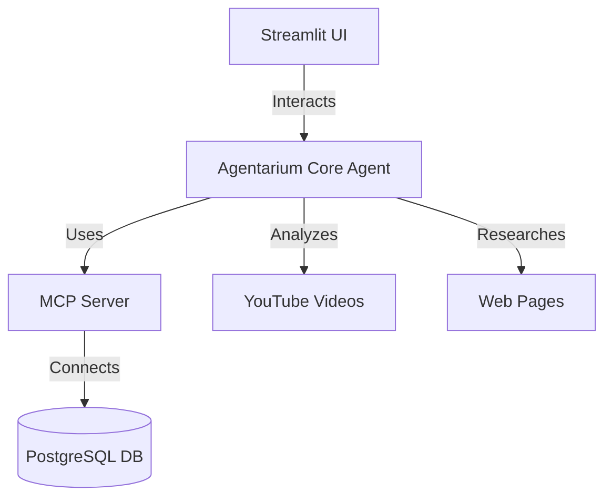

<!-- PROJECT HEADER -->
# 🤖 Agentarium: The AI Agent Ecosystem

> **A living ecosystem of intelligent agents for databases, video, and web research.**

[](https://github.com/yourusername/agentarium/actions)
[](LICENSE)
[](https://www.python.org/)
[](CONTRIBUTING.md)

---

<br>

# 🌟 Overview

Agentarium is a next-generation, modular Python platform for building, managing, and deploying intelligent agents. With a beautiful UI, seamless PostgreSQL integration, and advanced AI capabilities, Agentarium empowers you to automate database analysis, extract insights from YouTube videos, and perform deep web research—all in one place.

### 🏆 Key Value Propositions
- **Unified Agent Ecosystem:** Manage multiple AI agents in a single, extensible platform.
- **Multi-Modal Intelligence:** Analyze databases, videos, and web content with ease.
- **Modern UI/UX:** Enjoy a beautiful, responsive interface built with Streamlit.
- **Plug-and-Play Extensibility:** Add new tools, models, and workflows effortlessly.
- **Open Source & Community-Driven:** MIT-licensed and ready for collaboration.

<div align="center">
    <a href="#-demo-videos"></a>
    <a href="#-getting-started"></a>
</div>

---

# 🎬 Demo Videos

Experience Agentarium in action!

| Capability         | Description                                          |
|-------------------|-------------------------------------------------------|
| Database Analysis | See Agentarium analyze and visualize PostgreSQL data. |
| Web Research      | Watch the agent extract and summarize web content. |
| YouTube Insights  | Deep-dive into YouTube video transcript analysis. |

https://github.com/user-attachments/assets/7b481ed5-1a1d-4ffb-b3dd-6e9b35ed2696

<br>

https://github.com/user-attachments/assets/2404ccff-021b-4d57-9a8d-f8dc594f309d

<br>

https://github.com/user-attachments/assets/36fbfe79-8b87-42e4-a67d-01b32c026730

---

<br>

# ✨ Features & Capabilities

- 🧠 **Intelligent Agent Platform:** Modular, extensible, and easy to customize.
- 🐘 **Database Analysis:**
  - Connects to PostgreSQL
  - Schema introspection, query suggestions, and data visualization
- 🎥 **YouTube Video Analysis:**
  - Extracts full transcripts
  - Provides deep, actionable insights
- 🌐 **Web Research:**
  - Visits and summarizes web pages
  - Extracts trends and key information
- 💻 **Modern UI:**
  - Responsive Streamlit interface
  - Dark mode ready
- 🔌 **Extensible Tools:**
  - Add new models, APIs, and workflows
- 📊 **Performance:**
  - Fast, reliable, and scalable

---

<br>

# 🛠️ Getting Started

## 1. Clone the Repository
```bash
git clone https://github.com/yourusername/agentarium.git
cd agentarium
```

## 2. Install Dependencies
```bash
pip install -r requirements.txt
```

## 3. Configure Environment
Copy the example environment file and fill in your credentials:
```bash
cp src/env.example .env
# Edit .env with your PostgreSQL and Gemini API keys
```

## 4. Run the Platform
- **Start the MCP Server:**
  ```bash
  python src/mcp.py
  ```
- **Launch the UI:**
  ```bash
  streamlit run src/UI.py
  ```
- **Command-Line Agent:**
  ```bash
  python src/Agent.py
  ```

---

<br>

# ⚙️ Configuration

- All configuration is managed via the `.env` file (see `src/env.example`).
- Supports custom database, API keys, and model endpoints.

---

<br>

# 🏗️ Architecture Overview



<br>

- **Agentarium Core:** Orchestrates all agent actions and tool integrations
- **MCP Server:** Handles database operations and advanced analytics
- **UI:** Modern, responsive, and user-friendly

---

<br>

# 🤝 Contributing

We welcome contributions from the community!

- Open issues for bugs or feature requests
- Fork and submit pull requests
- Join discussions and help shape the roadmap

---

<br>

# 💡 Why "Agentarium"?

I chose the name "Agentarium" because I wanted a word that captures the idea of a vibrant, living ecosystem of intelligent agents—like an aquarium, but for AI. My goal is to create a space where agents can thrive, interact, and help users solve real-world problems in creative ways. The name reflects my vision for a platform that is both powerful and approachable, inviting users to explore, experiment, and build their own agent-driven workflows.

---

<div align="center">
  <strong>Crafted with passion for agent ecosystems and automation.</strong>
</div> 
